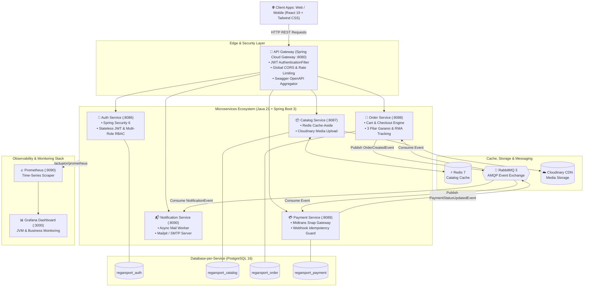
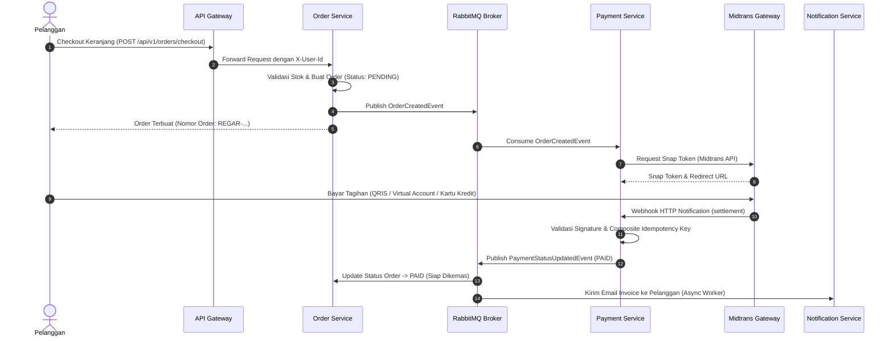
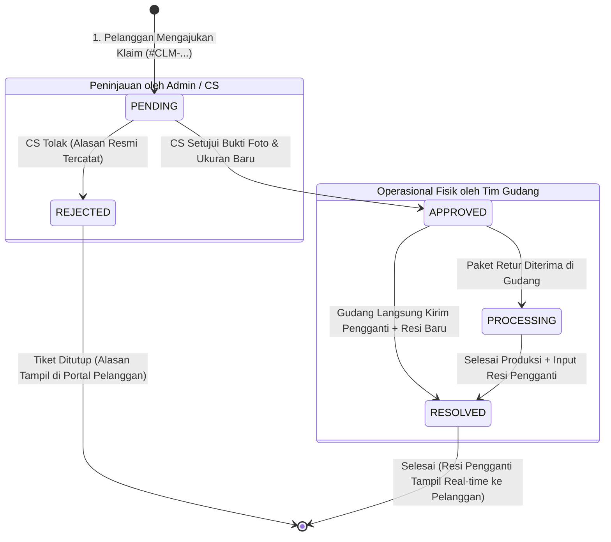
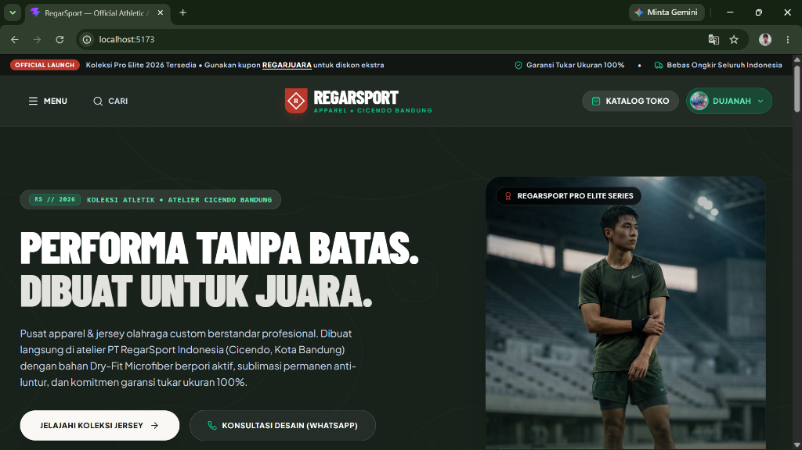
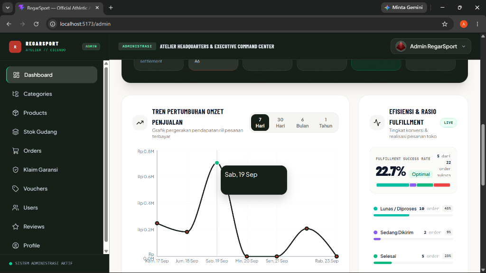
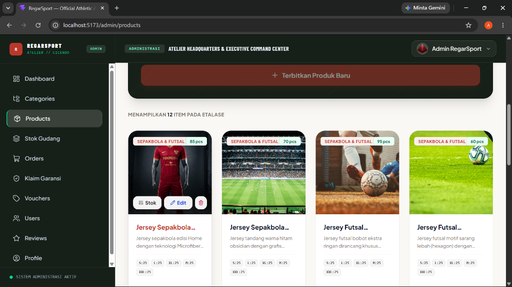
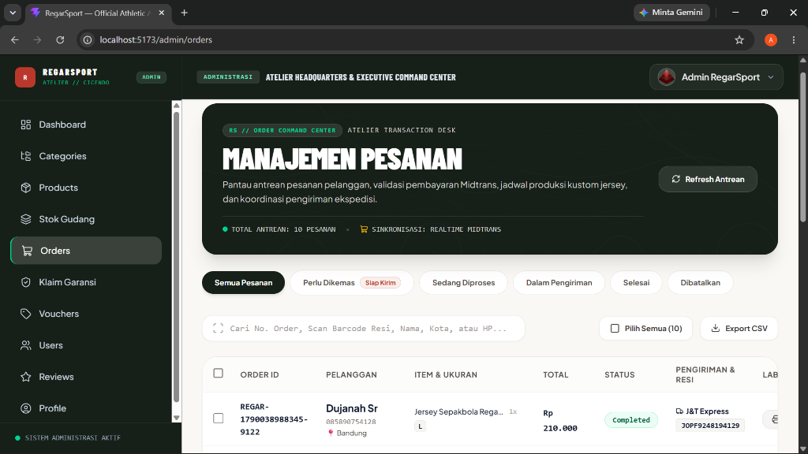
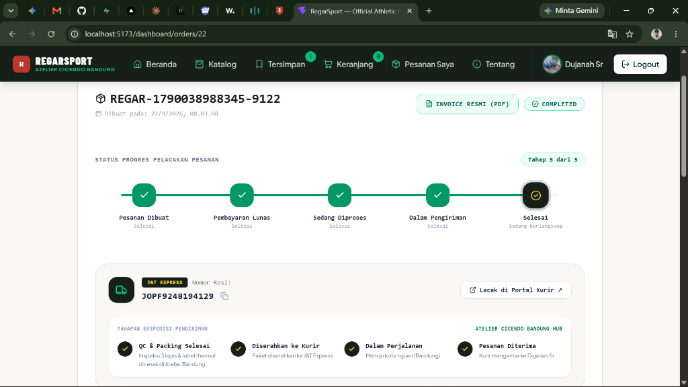
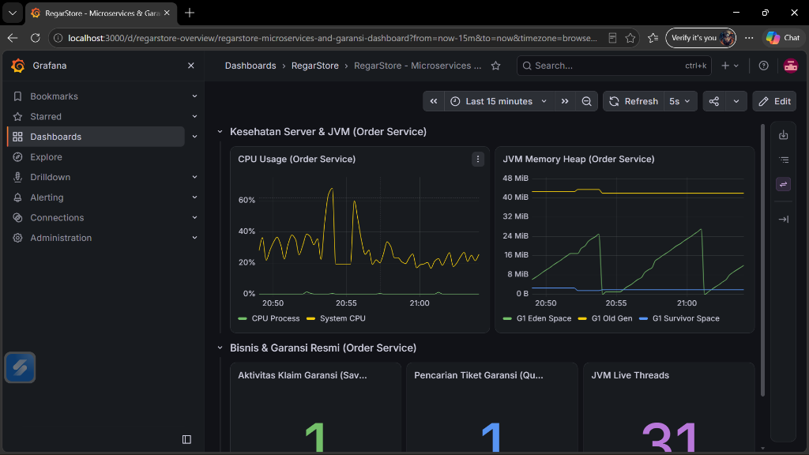

# 🏆 RegarStore — Enterprise Microservices E-Commerce & RMA Warranty Platform

> **Platform E-Commerce Apparel Olahraga & Manajemen Garansi (RMA) Skala Enterprise berbasis Arsitektur Microservices Terdistribusi, dibangun menggunakan Java 21, Spring Boot 3, Spring Cloud Gateway, PostgreSQL (Database-per-Service), RabbitMQ Event-Driven, Redis Caching, Prometheus & Grafana Observability, serta React 19 dengan Desain Sistem Athletic Atelier.**

---

### 🛡️ Tech Stack & Badges

[](https://openjdk.org/projects/jdk/21/)
[](https://spring.io/projects/spring-boot)
[](https://spring.io/projects/spring-cloud-gateway)
[](https://www.postgresql.org/)
[](https://www.rabbitmq.com/)
[](https://redis.io/)
[](https://prometheus.io/)
[](https://grafana.com/)
[](https://www.docker.com/)
[](https://react.dev/)
[](https://midtrans.com/)
[](#-pengujian-otomatis-automated-testing)

---

## 📌 Ringkasan Eksekutif Projek

**RegarStore** adalah ekosistem aplikasi e-commerce apparel dan jersey olahraga terdistribusi yang dirancang untuk menjawab tantangan industri nyata: **pemisahan domain layanan (*Domain-Driven Design*)**, **keandalan transaksi tinggi (*high throughput & low latency*)**, **pemrosesan asinkron nir-hambatan (*event-driven messaging*)**, serta **layanan purna jual transparan (*RMA - Return Merchandise Authorization & Komitmen Garansi Tukar Ukuran 100%*)**.

Seluruh arsitektur backend dibangun dengan standar rekayasa perangkat lunak modern:
- **Zero Tight-Coupling**: Tidak ada SQL `JOIN` lintas-database antar-layanan.
- **Database-per-Service**: Setiap domain memiliki skema database PostgreSQL mandiri (`auth`, `catalog`, `order`, `payment`).
- **Asynchronous Reliability**: Transaksi checkout, status pembayaran, dan email notifikasi dikomunikasikan secara asinkron via message broker RabbitMQ dengan *dead-letter* & *auto-retry*.
- **Full Observability**: Monitoring langsung metrik JVM (Memory heap G1GC, garbage collection pause, thread pool) dan indikator bisnis via Prometheus dan Grafana.
- **Athletic Atelier Design System**: Antarmuka responsif bernuansa olahraga profesional dengan perpaduan warna *Warm Sand* (`#FAF8F4`), *Tactical Forest* (`#162018`), corak kontur topografi, dan aksen *Terracotta* (`#B9382B`).

---

## 📐 Arsitektur Sistem (System Architecture)

### 1. Topologi Layanan Terdistribusi



---

### 2. Alur Transaksi Event-Driven (RabbitMQ Pipeline)



---

### 3. Siklus Hidup Klaim Garansi & Retur (RMA State Machine)



---

## 🌟 Keunggulan Rekayasa Perangkat Lunak (Key Engineering Highlights)

### 1. Pola *Database-per-Service*
Mencegah dependensi antar-skema. Setiap microservice memiliki kredensial dan database terisolasi di PostgreSQL:
- `regarsport_auth`: Tabel `users`, otorisasi peran (`ROLE_ADMIN`, `ROLE_CUSTOMER`, `ROLE_LOGISTICS`).
- `regarsport_catalog`: Tabel `categories`, `products`, ulasan produk.
- `regarsport_order`: Tabel `orders`, `order_items`, `cart_items`, `vouchers`, `warranty_claims`.
- `regarsport_payment`: Tabel `payments`, histori transaksi, idempotency logs.

### 2. Java 21 Virtual Threads (Project Loom)
Seluruh microservice mengaktifkan konkurensi modern melalui konfigurasi:
```yaml
spring:
  threads:
    virtual:
      enabled: true
```
Memberikan efisiensi memori tinggi saat menangani ribuan koneksi I/O pemesanan secara simultan tanpa risiko kehabisan *OS thread pool*.

### 3. Observability Penuh dengan Prometheus & Grafana
- Microservices mengekspos metrik sistem via **Spring Boot Actuator** di `/actuator/prometheus`.
- **Prometheus** melakukan scraping berkala terhadap CPU, JVM memory pools (Eden, Survivor, Old Gen), garbage collection pause time, dan throughput HTTP.
- **Grafana** dikonfigurasi dengan *automated provisioning* (`datasources.yml` & `regarstore-overview.json`) untuk visualisasi instan metrik performa teknis dan indikator bisnis.

### 4. Perlindungan Idempotensi Webhook (*Strict Idempotency*)
Untuk mencegah eksekusi ganda atau duplikasi status akibat *retry* dari payment gateway Midtrans, sistem menerapkan kunci idempotensi komposit:
```java
String idempotencyKey = orderNumber + "_" + transactionStatus;
```
Webhook yang sudah diproses tidak akan pernah dieksekusi ulang (*guaranteed idempotent execution*).

### 5. Multi-Role RBAC (Role-Based Access Control)
- **Pelanggan (`ROLE_CUSTOMER`)**: Eksplorasi katalog, kustom sablon nama/nomor punggung, checkout Midtrans, pelacakan ekspedisi real-time, cetak invoice PDF, pengajuan klaim garansi 7 hari, dan submit review produk.
- **Admin / CS (`ROLE_ADMIN`)**: Analisis omset penjualan Recharts, widget telemetri efisiensi fulfillment, manajemen produk & voucher promosi, moderasi ulasan, dan persetujuan klaim tiket `#CLM-...`.
- **Gudang / Logistik (`ROLE_LOGISTICS`)**: Antrean packing lunas (`PAID`), cetak label thermal A6 berstandar ekspedisi (100x150 mm), pencatatan nomor resi kurir, dan pengiriman produk pengganti retur.

---

## 📸 Bukti Nyata Implementasi (Live Screenshots)

Berikut adalah dokumentasi visual langsung dari antarmuka sistem yang beroperasi:

### 1. Storefront Utama Pelanggan (Athletic Atelier Experience)
> Etalase belanja modern bernuansa *Athletic Atelier* dengan hero banner dinamis, navigasi kategori olahraga, kartu promosi kupon voucher, dan integrasi konsultasi kustomisasi jersey.



---

### 2. Executive Command Center: Analisis Omzet & Telemetri Fulfillment
> Dashboard eksekutif admin yang menyajikan grafik tren pertumbuhan omzet riil berbasis Recharts, dipadukan dengan widget telemetri efisiensi fulfillment presisi yang memantau konversi pesanan toko secara langsung.



---

### 3. Manajemen Inventaris & Workshop Apparel Olahraga
> Tata kelola katalog produk komprehensif dengan kartu formulir *Tactical Forest* bercorak topografi, chip ketersediaan stok per ukuran (S, M, L, XL, XXL), penetapan harga tier, serta upload foto produk ke CDN Cloudinary.



---

### 4. Order Command Center & Ekspedisi Pengiriman Logistik
> Pusat kendali operasional pesanan pelanggan dengan tab filter status terstruktur, sinkronisasi transaksi Midtrans, integrasi kurir ekspedisi (J&T Express, SiCepat), pencetakan resi thermal A6, dan ekspor data CSV.



---

### 5. Portal Pelacakan Pesanan & Resi Pengiriman Pelanggan Real-time
> Pengalaman transparansi pesanan bagi pembeli: stepper progres 5 tahap interaktif, widget nomor resi ekspedisi yang dapat disalin, tautan pelacakan langsung ke portal kurir, serta unduh invoice resmi berformat PDF.



---

### 6. Observability Terdistribusi & Monitoring JVM di Grafana Dashboard
> Visualisasi real-time performa sistem backend, pemanfaatan memori heap JVM G1GC (Eden, Survivor, Old Gen), penggunaan CPU server, latensi HTTP, serta metrik volume transaksi bisnis.



---

## 📁 Struktur Multi-Module Proyek

```text
RegarStore/
├── backend/
│   ├── pom.xml                                   # Master Parent POM (Spring Boot 3.3.4, Java 21)
│   ├── common-dto/                               # Shared DTOs, Event Models & ApiResponse Wrapper
│   ├── api-gateway/            (Port 8080)       # Spring Cloud Gateway & Edge JWT AuthenticationFilter
│   ├── auth-service/           (Port 8086)       # Spring Security 6, JWT & Manajemen Akun Multi-Role
│   ├── catalog-service/        (Port 8087)       # Produk, Kategori, Redis Cache-Aside & Cloudinary CDN
│   ├── order-service/          (Port 8088)       # Checkout, Keranjang, Kupon Diskon, RMA & Garansi
│   ├── payment-service/        (Port 8089)       # Midtrans Snap, Webhook Idempotency & Events
│   └── notification-service/   (Port 8090)       # Consumer Email Asinkron RabbitMQ & Mailpit
├── docker/
│   ├── docker-compose.yml                        # Stack Infrastruktur (Postgres, Redis, RabbitMQ, Mailpit, Prometheus, Grafana)
│   └── grafana/
│       └── provisioning/                         # Auto-provisioning Datasource & Dashboard Grafana
├── docs/
│   ├── DEPLOYMENT_GUIDE.md                       # Panduan Deployment Produksi (Railway & Cloud)
│   └── images/                                   # Dokumentasi visual screenshot sistem
├── FE/
│   └── regarsport-frontend/    (Port 5173)       # React 19 + TypeScript + Tailwind CSS (Vite)
├── run-backend.bat                               # Script otomatisasi startup microservices (lean JVM)
└── stop-backend.bat                              # Script graceful shutdown port backend
```

---

## 🧪 Pengujian Otomatis (Automated Testing)

Proyek ini dilengkapi dengan rangkaian pengujian otomatis (*unit & integration tests*) menggunakan **JUnit 5**, **Mockito**, dan **AssertJ**:

```bash
# Menjalankan seluruh test suite di backend
cd backend
mvn clean test
```

### Ringkasan Cakupan Pengujian:
```text
Modul Layanan             Komponen yang Diuji                       Hasil
---------------------------------------------------------------------------------
order-service             WarrantyClaimServiceTest (Alur RMA)        7 Passed
order-service             OrderServiceTest (Checkout & Payment)      5 Passed
order-service             CartServiceTest (Shopping Cart Logic)      4 Passed
catalog-service           ProductServiceTest & CategoryTest          15 Passed
auth-service              AuthServiceTest & Token Verification       10 Passed
payment-service           WebhookServiceTest & PaymentService        8 Passed
api-gateway               AuthenticationFilterTest & JwtUtil         7 Passed
---------------------------------------------------------------------------------
Total Pengujian Otomatis                                             56 Passed (100%)
```

---

## 🚀 Panduan Deployment Produksi (Railway & Cloud)

Panduan deployment lengkap dan terstruktur ke penyedia cloud seperti **Railway**, Render, atau VPS mandiri telah disediakan secara terperinci di:

👉 **[Buka Panduan Deployment Produksi (docs/DEPLOYMENT_GUIDE.md)](docs/DEPLOYMENT_GUIDE.md)**

Panduan tersebut mencakup:
1. Konfigurasi 1-klik Database PostgreSQL, Redis, dan RabbitMQ di Railway.
2. Pengaturan variabel lingkungan bersama (*Shared Environment Variables*) untuk Microservices.
3. Skrip build dan start command hemat memori (`-XX:MaxRAMPercentage=75.0`).
4. Deployment frontend React Vite ke Vercel / Railway Static Site.

---

## ⚡ Panduan Menjalankan Sistem Secara Lokal (Local Setup)

### 1. Prasyarat Sistem
- **Java 21 LTS** (JDK 21)
- **Apache Maven 3.9+**
- **Docker Desktop** (untuk PostgreSQL, Redis, RabbitMQ, Mailpit, Prometheus, Grafana)
- **Node.js 20+** & **npm**

### 2. Jalankan Infrastruktur Docker
```bash
cd docker
docker compose up -d
```
Layanan yang aktif:
- **PostgreSQL**: `localhost:5433` (atau `5432`)
- **Redis**: `localhost:6379`
- **RabbitMQ Dashboard**: `http://localhost:15672` (Kredensial: `guest` / `guest`)
- **Mailpit Web UI**: `http://localhost:8025`
- **Prometheus**: `http://localhost:9090`
- **Grafana**: `http://localhost:3000` (Kredensial: `admin` / `admin`)

### 3. Jalankan Seluruh Microservices Backend
Gunakan script otomatis yang telah disiapkan (sudah dioptimalkan dengan flag alokasi memori hemat JVM):
```cmd
run-backend.bat
```
*Atau jalankan secara manual per modul via Maven:*
```bash
mvn -pl backend/auth-service spring-boot:run
mvn -pl backend/catalog-service spring-boot:run
mvn -pl backend/order-service spring-boot:run
mvn -pl backend/payment-service spring-boot:run
mvn -pl backend/notification-service spring-boot:run
mvn -pl backend/api-gateway spring-boot:run
```

### 4. Jalankan Antarmuka Web (Frontend)
```bash
cd FE/regarsport-frontend
npm install
npm run dev
```
Buka browser di: **`http://localhost:5173`**

### 5. Akses Dokumentasi API (OpenAPI / Swagger)
Buka dokumentasi interaktif seluruh endpoint microservices terpusat melalui API Gateway:
```
http://localhost:8080/swagger-ui.html
```

---

## 👤 Profil Pengembang (Author)

**Abu Dujanah Siregar**
- **Keahlian Utama**: Java Enterprise, Spring Boot, Microservices Architecture, Event-Driven Systems, Distributed Databases, React Frontend.
- **LinkedIn / Portofolio**: [linkedin.com/in/abudujanahsiregar](https://linkedin.com)
- **Email**: abudujanahsiregar@gmail.com
- **GitHub**: [@DujanahSr](https://github.com/DujanahSr)
